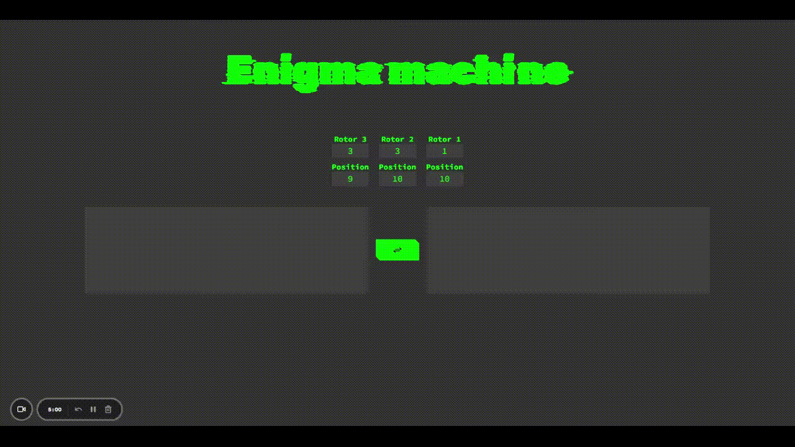

# Enigma Machine

    

## Description

This is a small, sofisticated React based enigma machine app. The app allows the user to select which rotor combination (rotors 1 - 5) they want to use and allows the user to set the starting position of each rotor. The user then is able to encrypt a message, and will be able to decrypt it with the same rotor combination and initial starting position.

## Features

- Rotor combination: choose in which combination the letters should be scrambled (available rotors 1-5)
- Rotor position: set up the rotors starting position for a harder decrypting time
- Encrypt/decrypt messages: enter the message/encrypted message into the text field on the left. The right textfield will display the encrypted/decrypted message

## Live demo

You can try the enigma machine by visiting the [live demo](https://zack1808.github.io/enigma-machine/)

## How to run the app locally

If you want to run the app localy:

#### 1. Clone the repository

- HTTPS: `git clone https://github.com/Zack1808/enigma-machine.git`
- SSH: `git clone git@github.com:Zack1808/enigma-machine.git`
- GitHub CLI: `gh repo clone Zack1808/enigma-machine`

#### 2. Enter the project directory

`cd enigma-machine`

#### 3. Allow the app to install the necessary packages (Node.js has to be installed on the device)

`npm install`

#### 4. Start the app

`npm start`

After execution, the localhost server will startup and a browser window will open, previewing the enigma machine app.

## Contribution

Contributions to the enigma machine project are welcome. If you find any issues or want to add new features, feel free to create a pull request. Make sure to follow the project's coding conventions and provide detailed information about your changes.

## Contact

If you have any questions or suggestions, you can reach me via:

- Mail: jeanpierrenovak23@gmail.com
- My portfolio: [jeanpierrenovak.netlify.app](https://jeanpierrenovak.netlify.app)

---

So open the app, use the following settup

- Rotor 1: 3, starting position: 9\n
- Rotor 2: 4, starting position: 20\n
- Rotor 3: 5, starting position: 25

rsj mwoxe nxlnslbmek rbb gxuowmfucs uqkljvbb!
